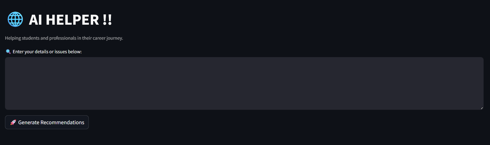

# AI-HELPER

A Streamlit web app powered by **Google Gemini** that analyzes input text and provides actionable recommendations to improve your websites or projects.

---

## 🚀 Features
- **Gemini AI integration** for intelligent recommendations  
- Clean **Streamlit interface**  
- Supports **real-time response streaming**  
- Beginner-friendly setup  

---
## 📂 Project Structure
```
project-folder/
├── app.py # Main application script
├── README.md # Documentation
├── .gitignore # Ignore sensitive files
└── requirements.txt # Python dependencies 
```

---

## 🔧 Prerequisites
- **Python 3.9+** installed  
- **Google Cloud project** with Vertex AI API enabled  
- **Service Account** with appropriate permissions  

---

## 🛠 Installation

### 1. Clone the repository
```bash
https://github.com/NagaprajwalB/AI-HELPER.git

cd AI-HElPER
```
### 2. Install dependencies
```
pip install -r requirements.txt
```
### ⚙️ Configuration

Open ```app.py``` and replace:

```
project="YOUR_GCP_PROJECT_ID_HERE"
```
With your actual Google Cloud Project ID
```
project="your-project-id"
```
### ▶️ Run the App
```
streamlit run app.py
```
Then open the local URL in your browser:
```
http://localhost:8501
```

### 📸 Screenshot



### 🤝 Contributions

**Feel free to fork, improve, and submit pull requests!**
